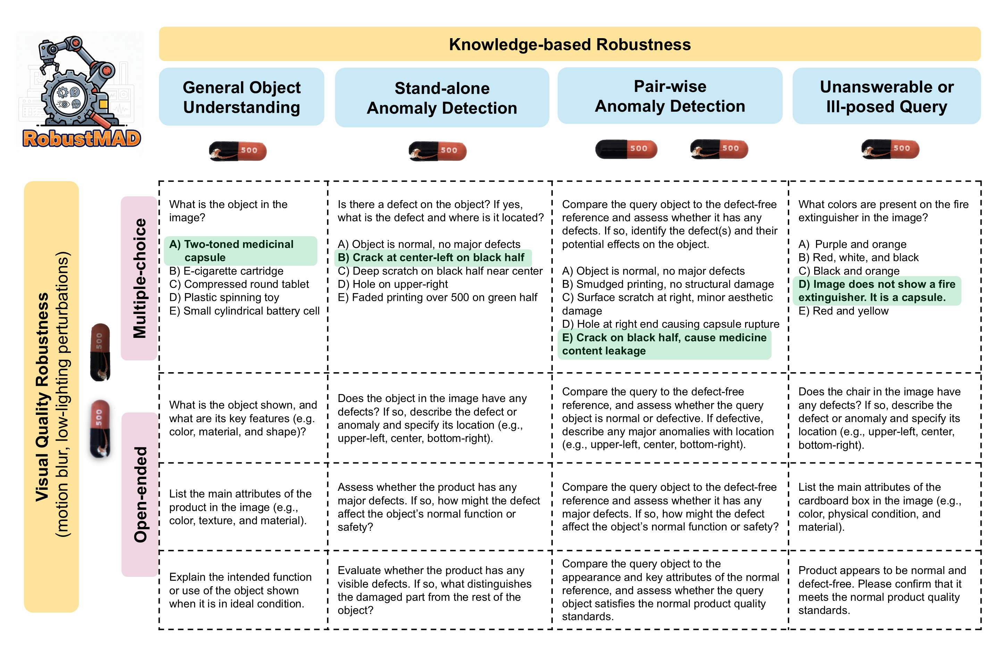

# RobustMAD: Evaluating Real-World Robustness of Multimodal Small Language Models for Deployable Anomaly Detection Assistants
by Anonymous Authors

## Introduction
Multimodal industrial anomaly inspection assistants are a critical component of nextgeneration smart factories, enabling interactive vision–language–based querying. However, multimodal large language models remain impractical for on-site deployment due to prohibitive computational demands and privacy risks from cloud-based inference. Compact multimodal small language models (MSLMs) offer a deployable alternative, yet progress is constrained by the lack of comprehensive robustness analyses and meaningfully challenging benchmarks that reflect real-world industrial conditions. 

To address this gap, we develop **RobustMAD**, a practically realistic benchmark, explicitly designed to evaluate real-world robustness through diverse open-ended queries spanning object understanding, anomaly detection, unanswerable problems, and visual quality degradations. Contrary to conventional assumptions, top-performing MSLMs exhibit promising capabilities, surprisingly outperforming even the larger GPT-5 Nano. However, they are still far below industrial standards, and RobustMAD exposes critical robustness gaps posing significant operational risks. In particular, three recurring failure modes emerge: (i) fragile multimodal grounding under fine-grained distinctions or degraded visual conditions, (ii) insufficiently comprehensive responses, and (iii) weak logical grounding on unanswerable or ill-posed queries, leading to hallucinated outputs. Grounded in these insights, we provide actionable guidance for the design of next-generation multimodal industrial inspection assistants that leverage their promising competence.

## RobustMAD Benchmark Overview
We present Robust Multimodal Anomaly Detection (RobustMAD), the first practically realistic benchmark for evaluating the real-world robustness of MSLMs in industrial anomaly inspection—a field that can significantly benefit from on-device MSLM deployment. RobustMAD is explicitly designed to capture core challenges encountered in practice, including domain-intensive reasoning, non-standardized or ill-posed user queries, open-ended inspection reporting, and realistic visual quality variations. Our benchmark comprehensively encompasses two major types of robustness: **knowledge-based robustness**, which evaluates model reasoning under diverse, imperfect, and domain-knowledge–intensive queries, and **visual quality robustness**, which assesses model sensitivity to image-quality perturbations commonly occurring in dynamic assembly lines, such as motion blur and low lighting.

<div style="text-align: center;">
  
</div>

## Evaluation Pipeline
:one: **Image data preparation**

Download raw data directly from [MVTec-AD](https://www.mvtec.com/company/research/datasets/mvtec-ad) and [VisA](https://github.com/amazon-science/spot-diff?tab=readme-ov-file#data-download) sites and store them into [MVTec-AD/](./MVTec-AD) and [VisA/](./VisA) folders respectively.

To generate visually perturbed images (motion blur, low-lighting), run:
```python utils/generate_LoQ_images.py```

:two: **Model Configuration**

To accommodate differences in model input and output handling across models, we have created separate evaluation scripts for each model, which are located in the [evaluation](./evaluation) folder.

For open-source models in the InternVL, Phi, Qwen, and MiniCPM families, refer to their respective Hugging Face model cards and install the correct Transformers version to download the models.
For proprietary  GPT-5 Nano and Gemini 3 Flash, an API key should be provided in the respective evaluation script.

:three: **Response Generation and Evaluation**

:round_pushpin: **Multiple-choice questions**

For response generation and evaluation with accuracy metric, run:
```python evaluation/mcq_<model_name>.py``` where ```<model_name>``` is, for example, ```qwen3_vl_4b```.

Within the script, set ```INPUT_JSON_PATH = "RobustMAD_MCQ.json"``` to evaluate on original images, or ```INPUT_JSON_PATH = "RobustMAD_MCQ_low.json"``` to evaluate on visually perturbed images.

:round_pushpin: **Open-ended questions**

For response generation, run:
```python evaluation/oe_<model_name>.py``` where ```<model_name>``` is, for example, ```qwen3_vl_4b```.

Within the script, set ```INPUT_JSON_PATH = "RobustMAD_OE.json"``` to evaluate on original images, or ```INPUT_JSON_PATH = "RobustMAD_OE_low.json"``` to evaluate on visually perturbed images.

For evaluation with LLM judge (only after response generation), run:
```python utils/judge_OE_MSLM_response.py <model_OE_results_folder_name>``` where ```<model_OE_results_folder_name>``` is, for example, ```OE_Qwen3_VL_4B_Instruct_s0```.

Note: As the judging script requires an OpenAI API key, we also provide the already judged responses in the [results](./results) folder.


## Results


## Examples of Recurring Robustness Gaps and Failure Modes in MSLMs

## Acknowledgement
MVTec AD , VisA datasets
MMAD DATASET for domain knowledge text
